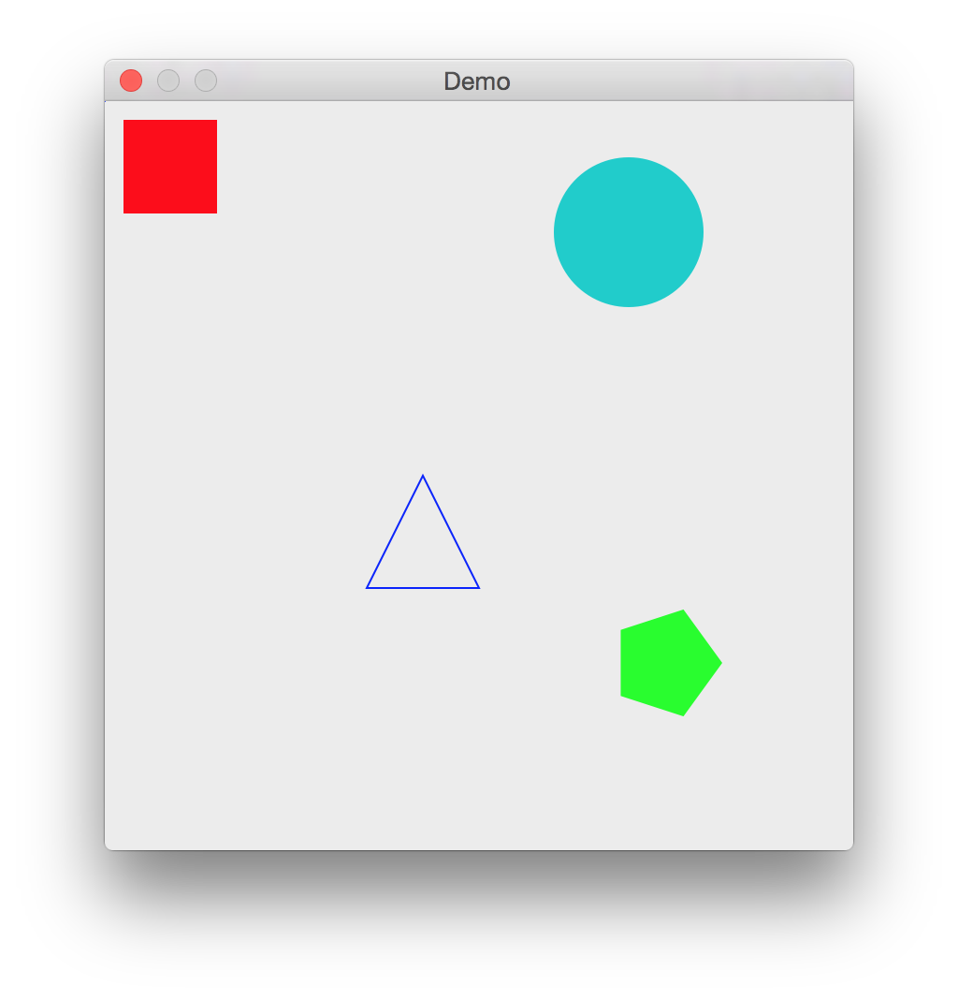

# gogui

**gogui** is an easy-to-use library for creating simple GUIs in Go. I intend to implement it for Mac OS X and have no plans to support other operating systems, although such implementations would be very welcome.

# Usage

gogui uses a simple runloop architecture. The runloop needs to run on the main OS thread, so you must call it directly from your main function:

    package main
    
    import "github.com/unixpickle/gogui"
    
    func main() {
        // some of your setup code here...
        gogui.Main(&gogui.AppInfo{Name: "Demo"})
    }

All GUI events and modifications must occur on the main goroutine. This can be achieved through the `RunOnMain` function, which runs a function asynchronously on the main goroutine:

    gogui.RunOnMain(func() {
        // Modify the GUI here...
    })

You may call `RunOnMain` before running `gogui.Main()`, so it is perfectly valid to do something like this:

    package main
    
    import "github.com/unixpickle/gogui"
    
    func main() {
        gogui.RunOnMain(func() {
    		w, _ := gogui.NewWindow(gogui.Rect{0, 0, 400, 400})
    		w.Show()
        })
        gogui.Main(&gogui.AppInfo{Name: "Demo"})
    }

Further demonstrations can be found in the [demo](demo) folder. And, as always, the [GoDoc](http://godoc.org/github.com/unixpickle/gogui) gives a full overview of the package.

# Screenshots

So far, gogui supports keyboard and mouse events, window management, and canvas drawing. Here is an example of what you can create with a simple canvas:



# TODO

 * Map keyboard events to match JavaScript keycodes.
 * Add canvas features
   * Get size for text
   * Translation + rotation + save/restore state
   * Arcs
   * Images
   * Line cap
   * Line join

# License

**gogui** is licensed under the BSD 2-clause license. See [LICENSE](LICENSE).

```
Copyright (c) 2015, Alex Nichol.
All rights reserved.

Redistribution and use in source and binary forms, with or without
modification, are permitted provided that the following conditions are met:

1. Redistributions of source code must retain the above copyright notice, this
   list of conditions and the following disclaimer. 
2. Redistributions in binary form must reproduce the above copyright notice,
   this list of conditions and the following disclaimer in the documentation
   and/or other materials provided with the distribution.

THIS SOFTWARE IS PROVIDED BY THE COPYRIGHT HOLDERS AND CONTRIBUTORS "AS IS" AND
ANY EXPRESS OR IMPLIED WARRANTIES, INCLUDING, BUT NOT LIMITED TO, THE IMPLIED
WARRANTIES OF MERCHANTABILITY AND FITNESS FOR A PARTICULAR PURPOSE ARE
DISCLAIMED. IN NO EVENT SHALL THE COPYRIGHT OWNER OR CONTRIBUTORS BE LIABLE FOR
ANY DIRECT, INDIRECT, INCIDENTAL, SPECIAL, EXEMPLARY, OR CONSEQUENTIAL DAMAGES
(INCLUDING, BUT NOT LIMITED TO, PROCUREMENT OF SUBSTITUTE GOODS OR SERVICES;
LOSS OF USE, DATA, OR PROFITS; OR BUSINESS INTERRUPTION) HOWEVER CAUSED AND
ON ANY THEORY OF LIABILITY, WHETHER IN CONTRACT, STRICT LIABILITY, OR TORT
(INCLUDING NEGLIGENCE OR OTHERWISE) ARISING IN ANY WAY OUT OF THE USE OF THIS
SOFTWARE, EVEN IF ADVISED OF THE POSSIBILITY OF SUCH DAMAGE.
```
